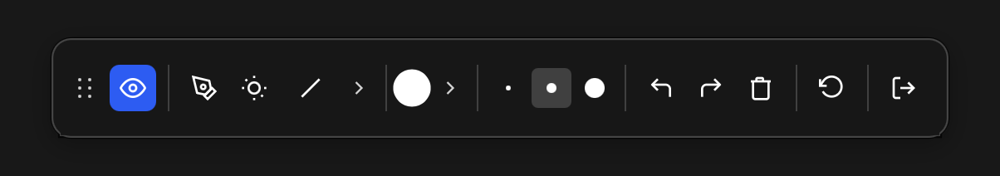
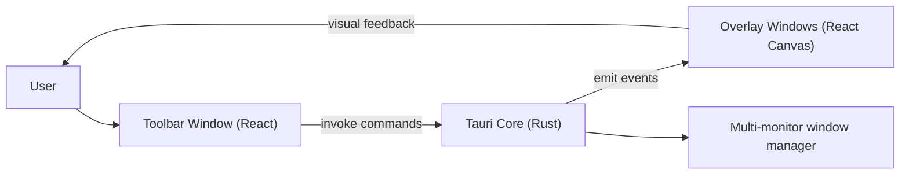

# Mira



> Show what you mean.

Mira is a lightweight desktop annotation overlay for live presentations, demos, and teaching.
You can draw on top of any app, highlight key points, and clear everything quickly without leaving your flow.

This project was created to solve a real day-to-day presentation problem and to learn Tauri by building a real product with AI-assisted development.
If this is useful for your workflow, feel free to use it, adapt it, and contribute.

## What Mira Does

- Opens a transparent, always-on-top drawing overlay
- Provides a floating draggable toolbar
- Supports pen + basic geometric shapes (line, rectangle, ellipse, arrow)
- Offers color and stroke controls
- Includes undo, redo, clear, and reset actions
- Includes spotlight/pointer support for presentations
- Supports multiple monitors
- Supports global shortcuts for fast control

## Why This Exists

During live calls and presentations, switching tools breaks flow.
Mira keeps annotation controls instantly available on top of your screen so explanations stay visual and fast.

## Tech Stack

- Tauri 2 (Rust backend + desktop shell)
- React 19 + TypeScript (UI)
- Vite (frontend build)
- Bun (package/runtime tooling)

## Architecture

Mira follows a split-window architecture:

- `toolbar` window: compact floating controller
- `overlay*` windows: transparent per-monitor drawing surfaces
- Rust core: creates/manages windows, handles positioning, and command/event bridge

Frontend windows call Rust commands (`invoke`), and Rust emits events back to overlays/toolbars for synchronized state changes.



## Project Structure

```text
mira/
  src/
    components/
      Toolbar.tsx
      Canvas.tsx
    hooks/
      useDrawing.ts
    types/
  src-tauri/
    src/
      lib.rs
    tauri.conf.json
```

## Keyboard Shortcuts

| Shortcut | Action |
|---|---|
| `Cmd+Shift+X` | Toggle overlay on/off |
| `Cmd+Shift+D` | Toggle draw mode |
| `Cmd+Shift+C` | Clear canvas |
| `Cmd+Shift+Z` | Undo |
| `Cmd+Shift+Y` | Redo |
| `Cmd+Shift+S` | Toggle spotlight |

On macOS, grant Accessibility permissions in System Settings for global shortcuts.

## Getting Started

### Prerequisites

- [Rust](https://rustup.rs/)
- [Bun](https://bun.sh/)
- macOS (primary tested target)

### Run in development

```bash
bun install
bun run tauri dev
```

### Build

```bash
bun run tauri build
```

## Contribution

Contributions are welcome.

1. Fork the repository
2. Create a feature branch
3. Make focused changes with clear commit messages
4. Open a pull request with:
   - what changed
   - why it changed
   - screenshots/gifs for UI updates

Please keep changes small and practical, and prefer incremental improvements.

## Project Info

- Author: Pedro Santos
- Repository: [p-c-g-s/MIRA](https://github.com/p-c-g-s/MIRA)

